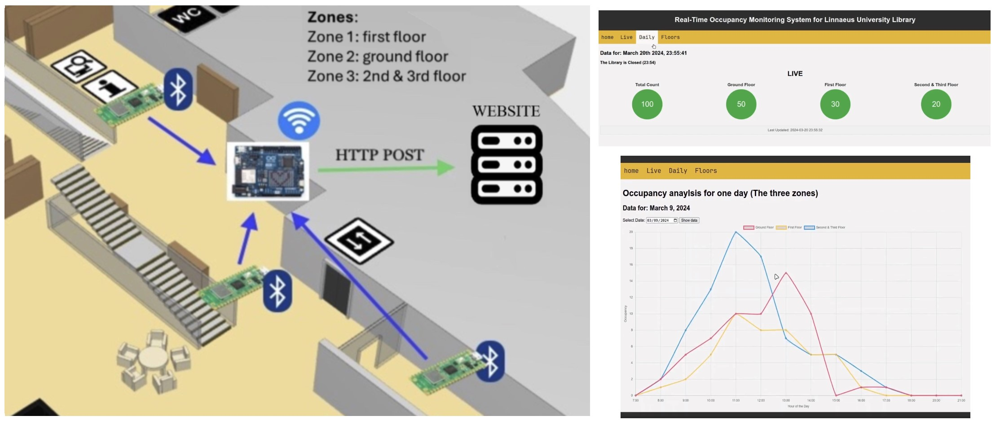

# Real-Time Occupancy Monitoring System for University Library

This project monitors occupancy levels in a library across different floors and zones. This is achieved by placing microcontrollers with ultrasonic sensors at the entrance of each zone and monitoring people passing/leaving. This information is sent to a central microcontroller over bluetooth, which keeps track of the current counts of each zone, as well as the total occupancy level in the library. This central microcontroller then forwards the most recent counts to our website over wifi. The occupancy data is stored in a database, which allows for displaying historic data on the website. 

### Zones monitored
- **Zone 1:** First floor
- **Zone 2:** Ground floor
- **Zone 3:** Second and Third floor

### Microcontrollers
- **3 x Raspberry Pi Pico W**<strong> (2 x Ultrasonic sensors each, batteries)</strong>
- **1 x Arduino UNO Rev 4 Wifi**

The web server is a Node.js Express and stores occupancy data in MongoDB.

### Arduino - C++ Code

The `/Microcontrollers/Arduino` directory contains two versions of the Arduino code, with and without freeRTOS. Ideally, we wanted to utilize freeRTOS, but ran into memory problems when trying to communicate with 3 Picos. Therefore, the `ArduinoFreeRTOS.ino` version only communicates with 2 Pico units, while the non-RTOS `ArduinoCode.into` code does the complete job, communicating with all 3 Picos.

## 

## 
**Contributors:** Ludvig Svensson & Seif-Alamir Yousef
